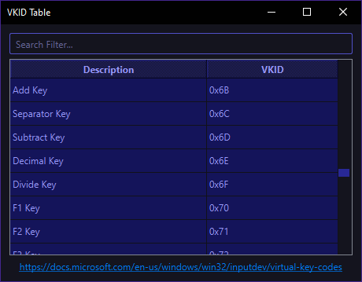

# Qt VKID Table Widget
A widget for Qt that displays a table of virtual key IDs (VKIDs), complete with a search bar, and clipboard support for copying VKIDs from the table. This widget is based on a layout, meaning it is actually a subclass of a Qt layout with predefined elements contained within. This repository is meant to be used as a submodule in other repositories, and when doing so, the "include" branch should be used for convenience.

## Screenshot
_Stylesheet used in screenshot: [indigo-stylesheet](https://github.com/PsychedelicShayna/indigo-stylesheet/)_

## Dependents
- [cursor-locker](https://github.com/PsychedelicShayna/cursor-locker)
- [cursor-rails](https://github.com/PsychedelicShayna/cursor-rails)
